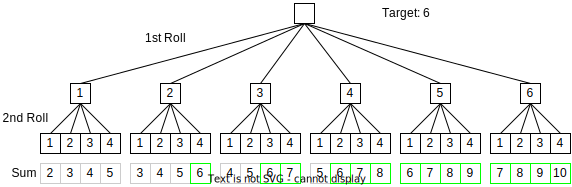
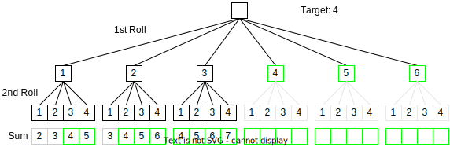

# Technical Details

## Probability Calculation

The goal is to calculate the probability of the sum of multiple dice being larger or equal to a target.

Assuming, each dice is a fair dice, the probability of rolling a certain number is $\frac{1}{n}$ for a $n$-sided dice. Rolling two n-sided dices, the probability of rolling a certain combination is $\frac{1}{n^n}$. All combinations are equally likely when rolling multiple fair dice. To answer the question, all combinations need to be summed, the number of sums larger or equal to the target counted and divided by the total number of combinations.

This can be visualised in a tree diagram, for rolling one 6-sided dice (d6) and one 4-sided dice (d4) with 14 out of 24 (~58,3%):



A naive, first implementation approach would look similar:
```
combinations = find_all_combinations()
matching_combinations = combinations.map((combination) => sum(combination))
                                    .filter((sum) => sum >= target)
probability = matching_combinations.length() / combinations.length()
```
This approach has two major problems:
1. The number of permutations grows exponentially ($O(c^n)$). The number of combinations $c$ with the possible dice could be calculated as $$n_c = 4^{n_{d4}} *6^{n_{d6}} *8^{n_{d8}} *10^{n_{d10}} *12^{n_{d12}} *20^{n_{d20}}$$ with $n$ being the amount of dices with the respective type. Even with just 5 d20, the calculation takes a noticeable amount of time. Since the probability should be calculated on every input change for the input, this approach is unusable beyond 4-5 dice. 
2. The calculation is done in the main thread (in Dart/Flutter called Isolate). Therefore, the UI is not responding.

The second problem is solved by running the calculation in a background isolate. Although the calculation is slow without solving the first problem, bigger calculations should not be done in the main thread to keep the UI refreshing.
Whenever a new calculation is required, old background isolates are cancelled and a new isolate is started. First, the isolate calculates the requested dice combination probability, streams the result to the UI isolate and continues to iterate through all dice that could be added next. For each dice, the result is 'precomputed', sent to the UI isolate and displayed. Afterwards, the isolate terminates.

For the first problem, the exponential growth of combinations is the root cause of slow calculations. One approach would be to find a mathematical way of solving the problem without exploring all combinations. Another approach would be to reduce the number of combinations by utilising the desired use case: The target sum is in the range of 10-20. If we have three dice, then we already have several combinations that hit the target sum. Adding another dice to that combination would automatically hit the target and thus not need to be explored further. The more dice we add, the fewer combinations need to be explored. The algorithm is still in exponential complexity (when having large targets), but with practical, small targets, another dice would add fewer and less explorable combinations. This improvement can be shown in the tree diagram:


//TODO: number of explorable combinations with fixed target and adding dice (one target, all dice plotted)

The optimized implementation iteratively adds the dice and checks which combinations need to be explored further:
```
# only track the sum of a permutation, the actual combination is not relevant
explorable_combinations_sums = []
removed_combinations = 0

for d in dices:
    # every already removed combination is multiplied by the possible dice values
    # since those won't be further explored
    removed_combinations *= d

    new_combinations_sum = []
    for c in explorable_combinations_sums:
        for value in iterate_dice_values(d):
            new_combination_value = d * value
            if new_combination_value >= target:
                removed_combinations += 1
            else:
                new_combinations_sum.add(new_combination_value)
    explorable_combinations_sums = new_combinations_sum

probability = removed_combinations / (removed_combinations + explorable_combinations_sums.length())
```

## Multi Peer Sharing

The Multi Peer Sharing feature shows the current calculation of others. In testing with friends, it was common that several people calculated the probability of different game choices and we would compare those afterwards. Therefore, it would be helpful to see the calculation of others directly in the app.

Again, this feature should be easy to use and as unintrusive as possible. To achieve local data sharing, different technical ways would be possible. Using Bluetooth or Bluetooth Low Energy was dismissed due to a lack of cross-platform libraries. Using WebSockets requires some sort of backend server that connects the WebSockets of all devices and multiplexes the data. The chosen option is running a server on every device, listening to incoming HTTP requests on a local port. This approach is limited to all devices being in the same local network (= same WiFi network), which is useful for using network service discovery to detect other devices without manually entering connection information. A library is available that implements the platform-specific code and offers a unified interface across all platforms.

The network topology is a simple fully connected network. Each device (=node) keeps a list of known other nodes. When a node discovers a new node (using network service discovery), a hello-message is sent with its node id. The response contains the list of known other nodes. Iteratively, a hello-message gets sent to all nodes. This allows a node to discover the whole network by only knowing one node. In practice, only one node needs to be discoverable by network service discovery when a new device wants to join the network.
All nodes may become offline at any time. To save resources, each node will stop listening to HTTP requests when the app is paused (=goes into the background). For all peer nodes, the known last online time is tracked. This is updated by health-messages as well as all others. Health-messages will be sent periodically to all nodes and update the online status and peer list on both sides.
The actual data sharing is done in a push-message, containing the target, modifier, dice and probability of the current user input. Those messages will be sent only once, if a node is offline it will miss this message and only receives one when the target, modifier or dice are changed. 
